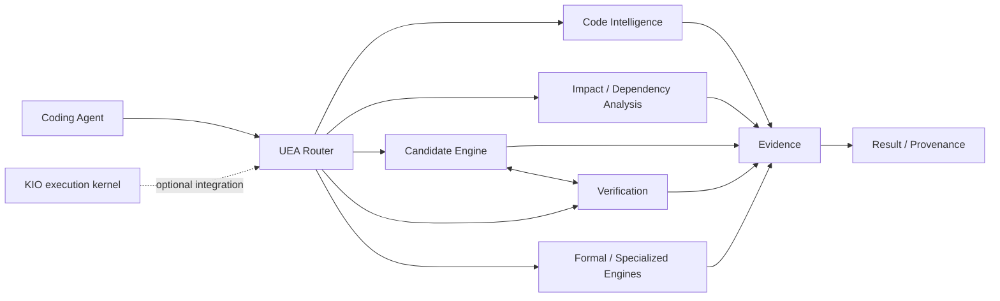

# Universal Engineering Augmentation

<p align="center">
  <a href="https://github.com/aspire488/Universal-Engineering-Augmentation/actions/workflows/ci.yml"></a>
  <a href="https://github.com/aspire488/Universal-Engineering-Augmentation/releases"></a>
  
  </a>
  
  
  
</p>

**Status:** Public alpha · v0.1.0 · Laya routing integrated

A **tool-agnostic engineering augmentation layer for coding agents**. It moves repeatable software-engineering work from probabilistic LLM reasoning into deterministic analysis, testing, verification, routing, and evidence systems.

## Why this exists

Coding agents are strongest when they reason about novel problems. They are a poor place to repeatedly re-derive facts that deterministic tools can establish faster and more reliably.

Universal Engineering Augmentation provides reusable engineering capabilities that can sit beside **OpenCode, Claude Code, Codex, or other coding agents** without making the core dependent on any one agent.

## Core capabilities

- **Structural code analysis** — tree-sitter parsing and symbol extraction
- **Dependency & impact analysis** — import graphs, symbol impact, blast radius
- **Tiered verification** — minimal → standard → strict → security → full
- **Property testing** — Hypothesis-driven edge-case exploration
- **Mutation testing** — measure whether tests actually detect faults
- **Formal verification** — SAT/SMT constraints with Z3
- **Candidate isolation** — Git worktrees for parallel implementations
- **Specialist routing** — deterministic-first task routing
- **Deterministic scoring** — repeatable candidate/evidence evaluation
- **Provenance** — evidence lineage and audit trails
- **Event logging** — structured SQLite records
- **Analytics** — DuckDB queries over engineering events
- **Project detection** — select capability profiles from repository structure

## Architecture

### Deterministic engineering pipeline



UEA keeps the probabilistic boundary explicit: agents generate strategy and candidates; deterministic capabilities establish structure, dependencies, verification results, constraints, and provenance.

```text
Coding Agent
(OpenCode / Claude Code / Codex / other)
        │
        ▼
┌──────────────────────────────────────┐
│ Universal Engineering Augmentation   │
├──────────────────────────────────────┤
│ Router + Specialist Registry         │
│ Code Intelligence                    │
│ Impact / Dependency Analysis         │
│ Candidate Engine + Worktrees         │
│ Verification + Testing               │
│ Formal / Specialized Engines         │
│ Provenance + Event Log               │
│ Analytics                            │
└──────────────────────────────────────┘
        │
        ▼
Evidence → Candidate → Verification → Result
```

### What stays with the LLM

- Strategy and architecture decisions
- Ambiguity resolution
- Novel reasoning
- Candidate generation
- Judgment calls where deterministic evidence is insufficient

### What should be deterministic

- Structural facts
- Dependency relationships
- Repeatable validation
- Property exploration
- Constraint checking
- Test-quality measurement
- Evidence recording
- Routing where rules are sufficient

### Deterministic-first routing with Laya fallback

Routing is deterministic-first: keyword classification runs first, and only
when it returns `UNKNOWN` does `core/laya_router.py` consult the local Laya
model (`UEA_LAYA_ENABLED`, default on, lazy single checkpoint). A Laya label
is validated against the task-type set before use and then feeds the exact
same capability/specialist/verification stack — it never bypasses validation,
the harness, or permissions. No Laya install, a disabled flag, or any model
failure leaves routing exactly as the deterministic classifier produced it.

### Current verified state

The current main baseline includes deterministic-first specialist routing with an optional local Laya System-1 fallback for `UNKNOWN` classifications.

- Deterministic classification always runs first.
- Laya is consulted only when deterministic routing returns `UNKNOWN`.
- Labels are validated against the existing task-type allow-list.
- The validated result feeds the existing capability, specialist, verification, and permission stack.
- Laya is lazy-loaded, uses one checkpoint, and can be disabled with `UEA_LAYA_ENABLED=false`.
- Missing dependencies or model failures fail soft and preserve deterministic routing.
- The final Laya integration batch is verified at **62/62 tests passing**, with `verify_all` and compile checks clean.

This does **not** turn UEA into an autonomous agent. UEA remains an agent-neutral engineering augmentation layer whose deterministic capabilities establish evidence and verification.

## Agent-neutral design

The core package contains no dependency on a specific coding agent.

**Reference integration:** OpenCode

**Planned first-class adapters:** Claude Code · Codex

The augmentation layer can also be exposed through MCP, CLI/API, filesystem interfaces, or other adapter mechanisms.

## Installation

```bash
git clone https://github.com/aspire488/Universal-Engineering-Augmentation.git
cd Universal-Engineering-Augmentation
pip install -e ".[dev]"
```

Requirements: Python 3.10+ and Git.

## Quick start

```python
from core.tree_sitter_engine import parse_file
from core.impact_model import build_import_graph
from core.verification import run_verification

result = parse_file("my_script.py")
graph = build_import_graph("src/")
report = run_verification(level="standard")
```

## Verification

```bash
python scripts/verify_all.py
pytest tests/ -v
```

CI validates Python 3.10, 3.11, and 3.12. Dependabot tracks Python and GitHub Actions dependencies weekly.

## Benchmarks

Current measurements demonstrate deterministic capability and latency on a real-world Python codebase:

| Operation | Time |
|---|---:|
| Tree-sitter parse (10 files) | 176ms |
| Impact analysis (1 file) | 24ms |
| Event log (1 event) | 16ms |
| Candidate proposal (2 candidates) | 1.1s |
| Property test | 253ms |
| DuckDB query | 77ms |

**LLM token/call reduction:** not currently measured. The project does not claim token savings without instrumentation that can reproduce them.

The reproducible benchmark harness records machine-readable deterministic measurements while explicitly reporting unavailable host-agent telemetry.

## Project maturity roadmap

- [x] Canonical Python packaging
- [x] Multi-version CI
- [x] Unit and integration tests
- [x] Security and contribution documentation
- [x] Agent-neutral core boundary
- [x] Deterministic specialist routing
- [x] Evidence provenance
- [x] Reproducible public benchmark harness
- [x] Dependency update automation
- [x] Automated tagged release pipeline
- [ ] First-class Claude Code adapter
- [ ] First-class Codex adapter
- [ ] Broader language grammars

## Release process

Releases use `vX.Y.Z` tags. The release workflow verifies that the tag matches `core.__version__`, validates the corresponding `CHANGELOG.md` entry, runs verification and tests, builds distributions, and publishes GitHub release notes from the changelog.

See [CHANGELOG.md](CHANGELOG.md) and [CONTRIBUTING.md](CONTRIBUTING.md) for the maintainer workflow.

## Contributing

Issues and pull requests are welcome, especially improvements that increase engineering capability without coupling the core to a single coding agent. See [CONTRIBUTING.md](CONTRIBUTING.md).

## Security

- No secrets or credentials are stored in the repository
- Runtime databases and worktrees are excluded from version control
- Event logs are metadata-oriented and should not contain secrets

See [SECURITY.md](SECURITY.md) for vulnerability reporting.

## License

MIT — see [LICENSE](LICENSE).
